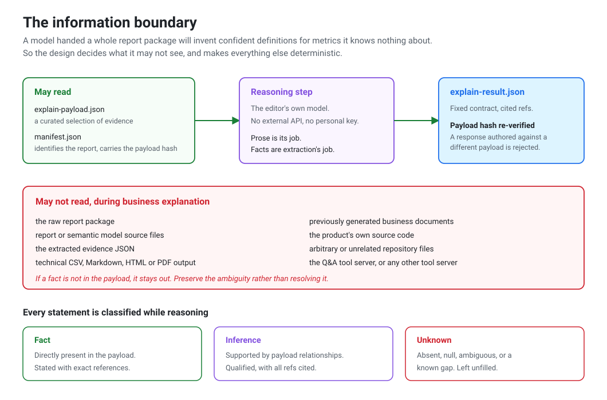

# Power BI Documentation Agent

**Built at ABC Fitness — Software Engineer, AI, on the Reporting team.**

An agent that turns a Power BI report already living in Git into business and technical
documentation, and delivers it as a draft pull request for a human to review.

This is the story of the problem I was handed, the design I arrived at, and what I
learned shipping it to a team.

---

## The problem I walked into

The reporting team maintained a large estate of Power BI reports in Git. Those reports
were how the organisation understood itself — operational and financial reporting that
people made real decisions against.

The documentation around them was a different story.

I sat with the two groups who depended on those reports and heard the same frustration
from opposite directions.

**Analysts and stakeholders** would open a report and not know what they were looking at.
A KPI tile showed a number. Was that number what they thought it was? Which page answered
their actual question? Could they trust it this week? They'd end up messaging whoever
built the report, and if that person had moved teams, they'd guess.

**Engineers** had it worse. Inheriting an unfamiliar report meant opening it and clicking
through every page to reconstruct what it did — which filters were applied and at what
scope, what the slicers were set to, which measures fed which visuals, where the data
came from. Every change began with an archaeology exercise, and the archaeology was
thrown away afterwards because there was nowhere to put it.

There was a deeper problem underneath both of these. People *had* written documentation
before. It went stale within a sprint or two, because nothing tied it to the report it
described. Once documentation has been wrong a few times, people stop reading it — and
once they stop reading it, they stop writing it. The team wasn't suffering from
laziness. They were suffering from a feedback loop that guaranteed decay.

So the brief I gave myself was narrower than "write documentation." It was: **make
documentation that regenerates from the report itself, and make it arrive through the
same review process as code.**

## Why the obvious solution was wrong

The obvious solution in 2026 is to point a language model at the report files and ask for
documentation. I tried thinking it through and it fell apart quickly.

A model handed a report package will produce fluent, confident, plausible documentation.
It will also produce fluent, confident, plausible definitions for metrics it has no
information about — and a reviewer cannot tell those two apart. The output reads uniformly
good. That is precisely what makes it dangerous in a document people will use to make
financial decisions. We'd have rebuilt the trust problem with better prose.

The insight that unlocked the project was inverting the question. Instead of asking what
the model could do, I asked **what has to stay deterministic, and how do I make that
boundary impossible to cross rather than merely discouraged.**

That reframing produced the architecture.

## What I built

A pipeline where facts and prose have completely separate provenance.

A deterministic extraction step parses the report package into a structured evidence
model — pages, visuals and their field bindings, filters separated by scope, slicers and
their applied state, measures, and the dependency and lineage graph. Every extracted fact
carries where it came from and a confidence level. Inferred lineage is labelled inferred.
Unresolved hops are labelled as gaps.

Only a curated slice of that evidence is handed to the reasoning step, along with a
manifest carrying a hash of it. The model writes prose from those two files and nothing
else. Facts absent from the payload stay absent — the instruction is to preserve the
ambiguity rather than resolve it. The result comes back as JSON against a fixed contract,
and the hash is re-verified before it's used, so an explanation authored against a
different report is structurally unusable.

After that, **no model is involved at all.** Rendering is deterministic. The same inputs
always produce the same documents.


The developer never sees any of those stages. They stay in the report repository and
invoke it as an editor Skill:

```text
/powerbi-documentation

Repository: owner/report-repository
Branch:     main
Report:     <exact report name>
```

What comes out is written for two audiences from one extraction:

| Output | Audience | Purpose |
|---|---|---|
| Business Markdown and HTML | Analysts, stakeholders | What the report is for, what each KPI means, when to use it |
| Technical Markdown, PDF, CSV inventories | Engineers | Pages, visuals, filters, slicers, measures, dependency and lineage maps |
| In-report HTML handoff file | Report developers | A self-contained file to embed on a Documentation page inside the report |

And the last step is deliberately not automation. The agent opens a **draft** pull
request, under the developer's own credentials, into their normal review process. It
doesn't merge. It doesn't publish to the BI service. The one operation that writes
anything to disk requires explicit human approval every time.

That wasn't timidity. It's what made the tool adoptable. An agent that opens a reviewable
draft is something a team will try on a real report tomorrow. An agent with write access
to the reporting estate is something a team will block in review, and they'd be right to.

## The boundary, drawn precisely



The payload hash check is the detail I'm proudest of. It's a few lines of work, and it
converts "the model should only use the payload" from a hope into an enforced property.

## Getting it into people's hands

I learned something uncomfortable partway through: I'd spent most of my effort on
extraction quality, and the thing actually standing between my work and its users was a
package manager that hadn't been added to someone's shell profile.

Distribution *was* the product.

The system lives across three repositories with three different jobs, and getting that
separation clear in people's heads was half the support burden.


The consequence that mattered: editing the source repository doesn't change what
anyone's editor is running, because an installed Skill is pinned to a released bundle.
Once I could explain that crisply, a whole category of recurring question disappeared —
and it's also what made cleaning up the source repository safe to do later.

To make setup a single command, I packaged the Python runtime into the Skill itself. A
launcher resolves a suitable interpreter, builds a private environment on first use, and
hashes its requirements so it rebuilds when dependencies change and not otherwise. No
clone, no manual environment, nothing to keep in sync by hand.

Then I wrote the cross-platform setup guide, ran the onboarding session, and debugged
what actually happened on real laptops. Almost none of it was the product:

- A package manager that installed successfully and then "didn't exist," because the two
  lines needed to add it to the shell had scrolled past — and the path differs between
  Apple Silicon and Intel.
- A CDN returning a transient `502` that looked exactly like a blocked corporate network.
- Tools installed but invisible until the shell restarted.
- Prompts asking for an administrator credential rather than a developer login.
- Multiple signed-in accounts, so commands silently ran as the wrong identity and a
  private repository reported itself as simply not existing.

Every one of those is now a named entry in a troubleshooting table keyed on the exact
error text people see, because that's what someone searches for at 9am before a demo.

## Technical Q&A, and why the tools are narrow

The technical document can run to thousands of lines. That's a good reference and a
terrible answer. Nobody inheriting a report wants to read it — they have one question,
like "which filters are actually applied on this page" or "is this measure used anywhere
or is it dead."

So I exposed the same evidence model to the editor as a set of narrow, read-only tools
over MCP.


The easy design is a single `ask_anything` tool. I deliberately didn't build that: if one
tool answers everything, it has to return everything, and a question about page filters
ends up dragging an entire lineage graph into the conversation and burying the answer.
Eleven narrow tools each answer one shape of question instead.

**[The full write-up is in `mcp.md`](mcp.md)** — the tool decomposition, the safety rules,
and the cross-platform configuration problems.

## Retiring what it replaced

Documentation generation had previously run as a CI pipeline. Moving to an editor-native
Skill made that pipeline redundant, and cleanup was the last thing I did.

It taught me that decommissioning is its own skill. I'd have said removing a retired
pipeline means deleting its config and scripts — so I traced the live path first, removed
the config, the scripts, the superseded workflow, the stale contract docs, the committed
output folders, and the tests that existed only to cover deleted code, all in one
reviewed pull request against the current main branch.

Then a failing check appeared on my own PR: *no configuration found in your project.*

The pipeline's webhook was still installed on the repository. Deleting the configuration
had stopped it from *doing* anything, but the integration kept firing on every push and
reporting a failure — which turned out to be the explanation for a "the old pipeline
still triggers" report I hadn't been able to account for. Removing the webhook is what
actually decommissioned it.

Decommissioning an integration means removing the *connection*, not just the
configuration it reads.

## Where it landed

- Documenting a report went from a multi-hour manual write-up to one invocation producing
  a reviewable draft pull request.
- Analysts and engineers each got a document written for them, generated from the same
  extracted evidence, so the two can't contradict each other.
- Onboarding a teammate went from "clone this, build that, configure these" to a single
  install command.
- The legacy pipeline, its scripts, its tests and its webhook were fully retired, leaving
  one live path — the one developers actually use.

## What I'd do differently

- **Split the runtime into variants earlier.** I shipped one trimmed runtime tuned for
  generation, and a packaging gap I only caught by testing the released bundle meant the
  Q&A server needed its own setup path. Two explicit variants from the start would have
  avoided a two-path setup story.
- **Treat the integration webhook as part of the migration plan,** not as cleanup
  afterwards.
- **Write the onboarding guide against a genuinely clean machine sooner.** Nearly every
  real failure was environmental, and those are the steps worth over-documenting.
- **Add a release smoke test** that runs the published bundle end to end against a sample
  report, so a packaging problem surfaces at release time rather than during someone's
  first day.

## Further reading

| Document | Contents |
|---|---|
| [`architecture.md`](architecture.md) | Component breakdown, pipeline stages, trust-boundary table |
| [`mcp.md`](mcp.md) | The MCP tool server in depth: tool design, safety rules, configuration |
| [`integrations.md`](integrations.md) | Every integration thread, in the order I hit it |
| [`experience.md`](experience.md) | What I took away, and what I'd carry into the next project |

---

### A note on scope

This repository is my own account of work I did, written from scratch. It contains no
proprietary source code, report packages, extracted evidence, generated client
documentation, or internal identifiers. All diagrams are original and were drawn for this
write-up.
