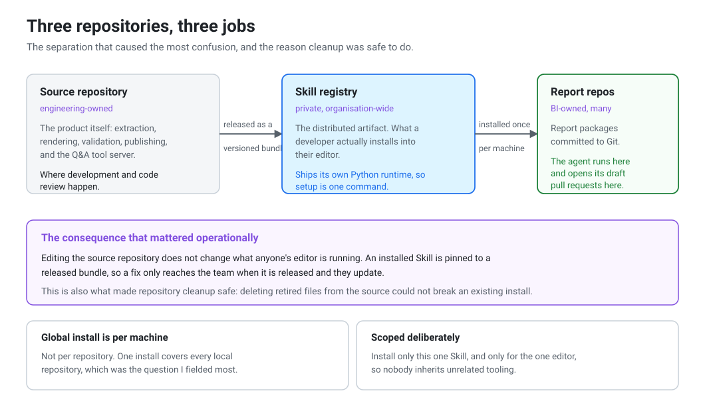
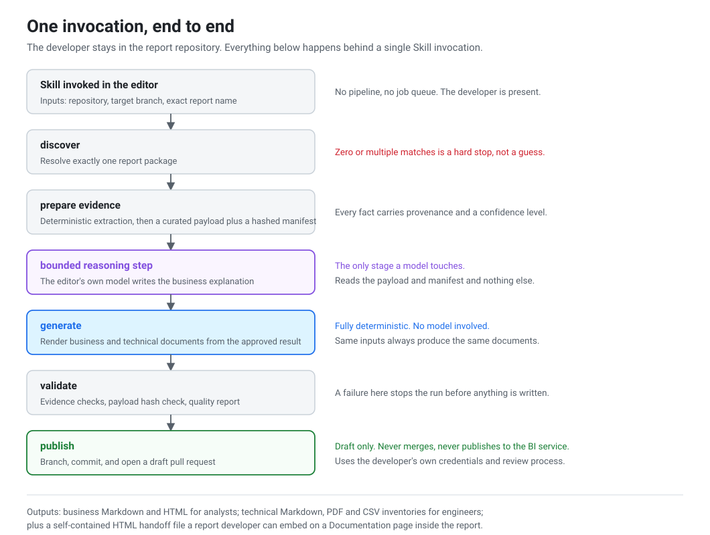

# Architecture

How the pieces fit together and what each stage does.

## Three repositories

The setup involves three repositories with different jobs, and keeping them straight was
a recurring source of questions.

**The source repository** holds the product: extraction, rendering, validation,
publishing and the MCP server. Development and code review happen here.

**The Skill registry** is private to the organisation and holds the released bundle. This
is what a developer installs into Cursor.

**The report repositories** hold the Power BI report packages. The agent runs inside
these and opens its pull requests here.

The practical effect is that editing the source repository does not change what anyone is
running. An installed Skill stays on the released bundle until the person updates, so a
fix reaches the team when it is released, not when it is merged. That is also why
removing old files from the source repository could not break anyone's install.

## Stages

### Discovery

Given a repository, branch and report name, find exactly one report package. Zero
matches or more than one is a stop, not a best guess, because documenting the wrong
report is worse than failing.

### Extraction

Parse the report package into a structured record: pages, visuals and their field
bindings, filters separated by report, page and visual level, slicers and their applied
state, measures, and the dependency and lineage graph.

Two things I cared about here.

Every item records where it came from and how confident the extraction is. Inferred
lineage is marked inferred and unresolved hops are recorded as gaps, so the documentation
can say so instead of presenting a guess as fact.

Everything downstream reads this record rather than parsing report files again. The
business wording step, the technical documents, the PDF and the MCP server all work from
the same extraction, so they cannot disagree with each other.

### The model step

This is the only stage a model touches.

Turning structured facts into readable wording is genuinely useful work for a model. The
risk is that a model given the whole report will also write confident definitions for
measures it has no information about, and those read exactly like the correct ones.

So the exchange is kept narrow.

A prepare step writes a payload holding a selected slice of evidence, plus a manifest
with a hash of that payload. The model reads those two files only. Not the report
package, not the full extraction, not previously generated documents, not the product
source, not the MCP server. Every statement has to cite payload references, and anything
missing from the payload stays missing.

The reply is written back as JSON in a fixed shape, and the payload hash is checked again
before it is used, so a reply written against a different payload is rejected.

### Rendering

From the extraction and the accepted wording, the run produces business Markdown and
HTML, technical Markdown, a PDF and CSV inventories covering pages, visuals, filters,
slicers, measures, dependencies, lineage and impact.

It also writes a standalone HTML file next to the report package. That file is a handoff
for a report developer to embed on a documentation page inside the report. It does not
change the report pages or the model, and binding it in is a deliberate manual step.
Being clear about that in the documentation avoided a lot of wrong expectations.

### Validation

Before anything is published there are checks on the extraction, the payload hash check
and a quality report. A failure stops the run before the publish stage, so there is no
half written branch or commit anywhere.

### Publishing

Create a branch, commit the files and open a draft pull request against the target
branch, using the developer's own authenticated GitHub CLI session. Their identity, their
permissions, their review process. No service account with write access across the
reporting repositories.

## The MCP server

Covered in [mcp.md](mcp.md). In short, the same extraction is exposed to Cursor as a set
of tools that only read, so a developer can ask a specific question instead of searching
a long technical document.

## Boundaries

| Boundary | Rule |
|---|---|
| Business wording | Payload and manifest only. No report files, no full extraction, no MCP |
| Rendering | Deterministic. No model involved once the wording is accepted |
| Model | The developer's own editor model. No external API and no personal key |
| Writes to a report repository | Draft pull request only, under the developer's own login |
| The one tool that writes files | Human approval required every time |
| Publishing to the Power BI service | Out of scope. Happens through the team's normal sync after merge |
