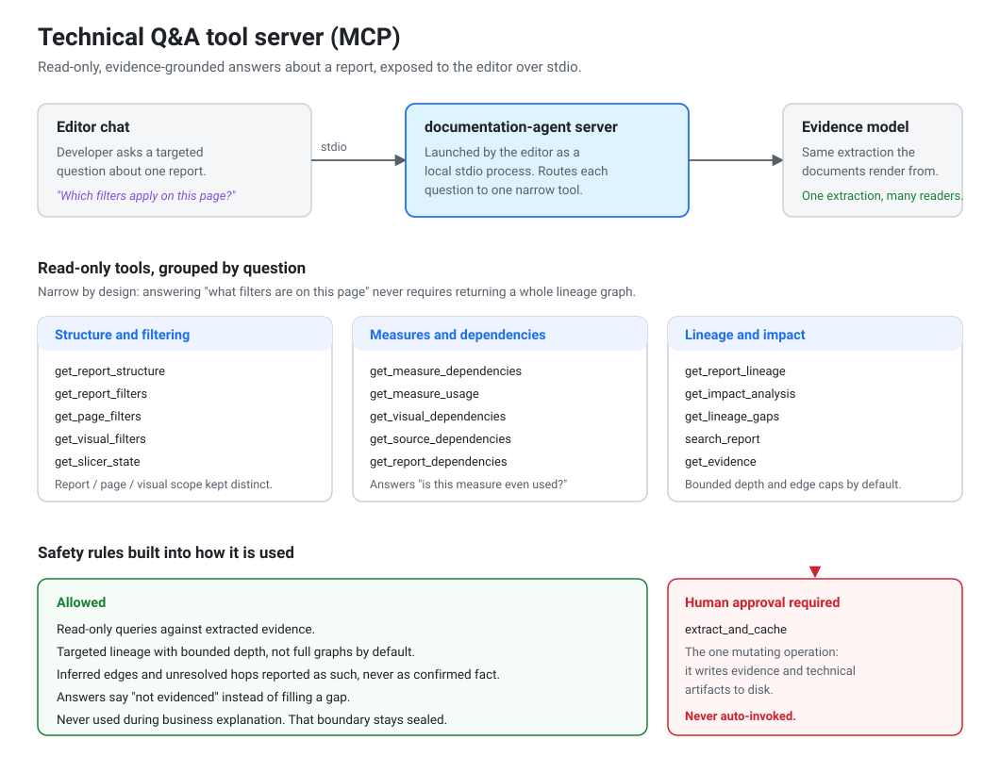

# The Technical Q&A tool server (MCP)

This is the part of the project I get asked about most, so it gets its own page.



---

## The problem it solves

The agent produces a technical document that can run to thousands of lines: every page,
every visual, every field binding, every filter and its scope, every slicer and its
applied state, every measure, the dependency graph, and the lineage map.

That is a good *reference*. It is a terrible *answer*.

An engineer picking up an unfamiliar report doesn't want to read it. They have one
question:

- "Which filters are actually applied on this page?"
- "If I change this table, what breaks?"
- "Is this measure even used anywhere, or is it dead?"
- "Where does this number come from?"

Searching a 3,000-line document for that is barely better than opening the report and
clicking around. So I exposed the same extracted evidence to the editor as a set of
narrow, read-only tools the developer can just ask.

## How it fits together

The editor launches the server as a local process and talks to it over stdio. The server
reads the **same evidence model** the documents are rendered from — one extraction, many
readers. There is no second parser to keep in sync, and an answer from the tool server
cannot disagree with the generated documentation, because both come from the same source.

```
editor chat  ──stdio──>  documentation-agent server  ──>  evidence model
                              (local process)              (structured extraction)
```

Configuration is a user-level entry in the editor's tool-server config, pointing at a
Python interpreter and asking it to run the server module. Once it's there, it works in
every repository you open rather than needing per-project setup.

## Why the tools are narrow

The easy design is one tool: `ask_anything(report, question)`. I deliberately didn't do
that.

If a single tool has to answer everything, it has to return everything — and "what
filters are on this page" ends up dragging an entire lineage graph into the conversation.
That's slow, it's expensive in context, and it buries the actual answer in noise.

So each tool answers one shape of question:

| Question | Tool |
|---|---|
| What's in this report? | `get_report_structure` |
| What's filtering it, and at what scope? | `get_report_filters`, `get_page_filters`, `get_visual_filters` |
| What are the slicers set to? | `get_slicer_state` |
| What does this measure depend on? | `get_measure_dependencies` |
| Is this measure used anywhere? | `get_measure_usage` |
| What feeds this visual? | `get_visual_dependencies` |
| Where does this data come from? | `get_source_dependencies`, `get_report_dependencies` |
| What breaks if I change this? | `get_impact_analysis` |
| What's the full picture? | `get_report_lineage` |
| What don't we know? | `get_lineage_gaps` |
| Find something by name | `search_report`, `get_evidence` |

A few details in there I care about:

**Filter scope stays distinct.** Report-level, page-level and visual-level filters are
genuinely different things, and so are *slicer controls* versus *the state a slicer is
currently set to*. Collapsing those would produce answers that are technically wrong in
the way that costs someone an afternoon.

**`get_measure_usage` exists because "is this dead?" is a real question.** It reports
whether a measure is actually used within the scanned metadata, and says so honestly when
the scan can't confirm it either way.

**`get_lineage_gaps` is a first-class tool, not an error path.** Lineage extraction can't
always resolve every hop. Rather than quietly dropping unresolved edges or presenting
guesses as fact, there's a tool whose entire job is "here's what we could not determine."

## The safety rules

These were the part I thought hardest about, because a tool server is an open door into
the product from inside a chat.

**It is never used during business explanation.** The business prose step has a sealed
information boundary — payload and manifest only. Letting the tool server feed extra
"facts" into that step would break the whole guarantee, so it is explicitly forbidden
there. The tool server serves the *technical* question flow, which is a separate
workflow.

**Lineage queries are bounded by default.** Targeted rather than full-graph, with depth
and edge caps. Partly for context economy, partly because an unbounded graph dump is not
an answer.

**Inference is labelled as inference.** Evidence carries confidence. Inferred edges and
unresolved hops surface as exactly that, never as confirmed fact. An answer that says
"not evidenced" is more useful than a confident wrong one.

**The one mutating tool cannot be auto-invoked.** `extract_and_cache` writes evidence and
technical artifacts to disk. It is the only tool that changes anything, and it requires
explicit human approval every time. An agent must not decide on its own to start writing
files.

**Unrelated tool servers are never evidence.** Whatever else is connected in the editor —
chat, issue trackers, monitoring, source hosting — none of it is a valid source of facts
about a Power BI report. Only this server and the extracted evidence are.

## What I learned building it

**Verify against the artifact people actually run.** The elegant instruction would have
been "the Skill already ships the server, just point your editor at it." I checked the
released bundle instead of assuming, and found its trimmed runtime is missing a
dependency the server needs — it falls back rather than starting a real tool server. The
elegant instruction would have produced a broken connection indicator for every person
who followed it, and I'd have been debugging it remotely after leaving. The documented
path uses a source-repository environment for Q&A while generation stays on the Skill.

**Configuration is where cross-platform bites you.** Nearly every setup failure was a
path problem, not a logic problem. A config copied from a macOS example points at a
Unix-style interpreter path that doesn't exist on Windows, where the virtual environment
puts its interpreter in a different subdirectory with a `.exe` extension. The error text
is unhelpfully generic. Both variants now appear explicitly in the setup guide, with
commands that *print the exact absolute paths* to paste in, rather than asking people to
construct them.

**Workspace-relative paths don't survive.** A config with a workspace-relative interpreter
path works in the one repository it was written for and silently breaks everywhere else.
User-level config with absolute paths is what makes "works in any repository" true.

**Nothing hot-reloads.** Tool-server config changes need a full editor restart, not a
window reload. Obvious once you know it; a dead end for an hour if you don't. It's in the
troubleshooting table now, keyed on the symptom rather than the cause.
