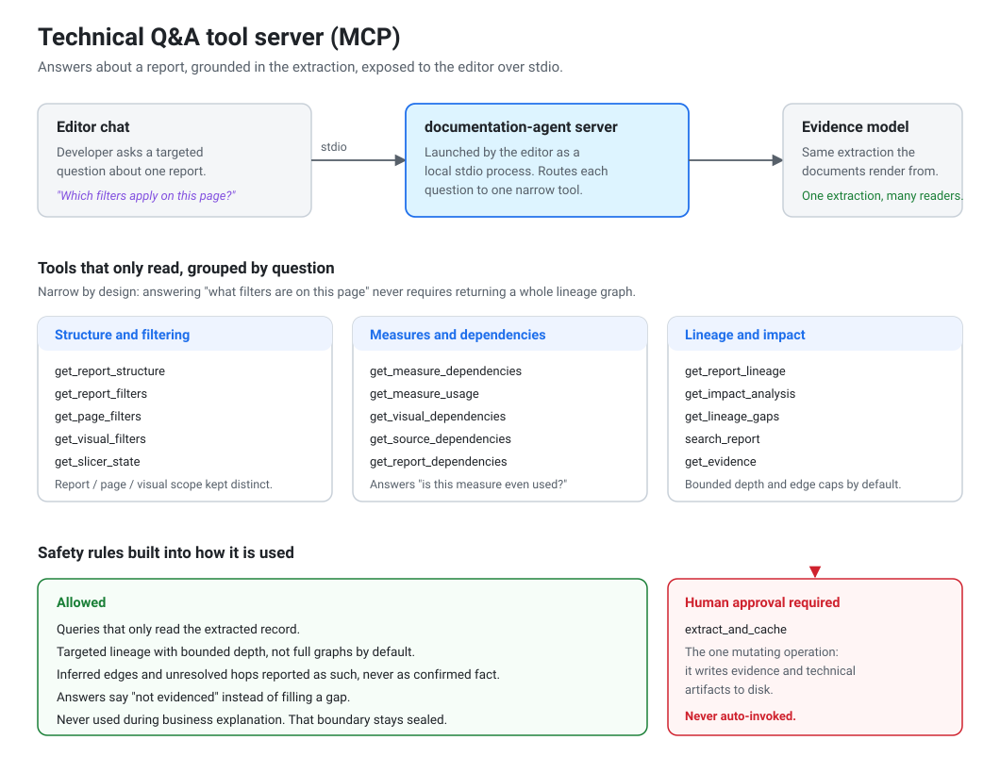

# The MCP server



## Why it exists

The technical document for a large report runs to a few thousand lines. It covers every
page, every visual, every field binding, every filter and its scope, every slicer and its
state, the measures, the dependency graph and the lineage map.

That is fine as a reference. It is not how anyone wants to answer a single question.

Someone picking up an unfamiliar report usually wants one specific thing:

- which filters are applied on this page
- what breaks if this table changes
- whether a measure is used anywhere or is dead
- where a number comes from

Searching a long document for that is not much better than opening the report and
looking. So the same extracted record is exposed to Cursor as an MCP server, and the
question gets asked directly in chat.

## How it connects

Cursor starts the server as a local process and talks to it over stdio. The server reads
the same extraction the documents are rendered from, so there is no second parser to keep
in step and an answer cannot contradict the generated documentation.

```
Cursor chat  ->  stdio  ->  MCP server  ->  extracted record
```

The configuration is a user level entry in Cursor's MCP config, pointing at a Python
interpreter and the server module. Put it at user level and it works in every repository
you open, rather than needing to be added per project.

## The tools

There are 22 tools that only read, and one that writes. They are grouped by the kind of
question being asked.

| Question | Tools |
|---|---|
| What is in this report | `get_report_structure`, `list_reports`, `get_report_purpose` |
| What is filtering it, and at what level | `get_report_filters`, `get_page_filters`, `get_visual_filters` |
| What are the slicers set to | `get_slicer_state` |
| What are the KPIs and their definitions | `get_kpis`, `get_kpi_dax` |
| What does this measure depend on | `get_measure_dependencies` |
| Is this measure used anywhere | `get_measure_usage` |
| What feeds this visual | `get_visual_dependencies`, `tables_for_visual` |
| Where does the data come from | `get_source_dependencies`, `get_report_dependencies` |
| What breaks if I change this | `get_impact_analysis`, `impact_of_table_change` |
| What is the full picture | `get_report_lineage` |
| What do we not know | `get_lineage_gaps` |
| Find something by name | `search_report`, `get_evidence`, `answer_report_question` |

## Why the tools are split up

The easy design is one tool that takes a report and a question. I did not build that.

If a single tool has to answer everything then it has to return everything, so a question
about page filters ends up pulling a whole lineage graph into the conversation. That is
slow, it fills up the context, and it buries the actual answer. Splitting the tools up
means a narrow question gets a narrow answer.

A few details in there that matter:

**Filter level stays separate.** Report level, page level and visual level filters are
different things, and a slicer control is different again from the state a slicer is
currently set to. Merging those would produce answers that are wrong in a way that costs
someone an afternoon.

**Measure usage is its own tool.** Whether a measure is used anywhere is a real question
when you are deciding if you can change or remove it. The tool reports what the scan
found and says so plainly when it cannot confirm either way.

**Lineage gaps are a normal result, not an error.** Extraction cannot always resolve
every hop. Rather than dropping the unresolved parts quietly or filling them in, there is
a tool whose job is to report what could not be determined.

## The rules around it

**It is not used for the business wording step.** That step reads the prepared payload
and manifest only. Letting the MCP server feed extra facts into it would break the whole
point of that boundary, so it is ruled out there. The MCP server serves technical
questions, which is a separate flow.

**Lineage queries are bounded by default.** Targeted rather than the full graph, with
limits on depth and number of edges. Partly to keep responses usable, partly because
dumping a whole graph is not an answer.

**Inferred results are labelled as inferred.** The extraction records confidence.
Inferred edges and unresolved hops come back as exactly that, never as confirmed fact. An
answer saying something is not evidenced is more useful than a confident wrong one.

**The one tool that writes needs approval.** `extract_and_cache` writes extraction output
and technical files to disk. It is the only tool that changes anything and it needs
explicit human approval each time. An agent should not decide on its own to start writing
files.

**Other MCP servers are not evidence.** Whatever else is connected in the editor, none of
it is a source of facts about a Power BI report. Only this server and the extraction
behind it.

## What I learned building it

**Test the thing that actually ships.** The neat instruction would have been that the
Skill already includes the server so you just point Cursor at it. I tested the released
bundle instead of assuming, and found a packaging gap that stopped the server starting
properly. Writing the neat instruction would have left everyone who followed the guide
with a server that would not connect.

**Configuration is where the operating system differences bite.** Nearly every failure
was a path problem rather than a logic problem, and the error text is generic enough to
be no help. A config copied from a macOS example points at a Python path that does not
exist on Windows, where the virtual environment keeps its interpreter in a different
folder with a .exe extension. Both versions are spelled out in the guide, with commands
that print the exact absolute paths to paste in.

**Workspace relative paths do not travel.** They work in the repository they were written
for and silently fail elsewhere. User level config with absolute paths is what makes
"works in any repository" true.

**Nothing reloads on its own.** Config changes need a full restart of the editor, not a
window reload. It is in the troubleshooting notes keyed on the symptom, because that is
what someone searches for.
